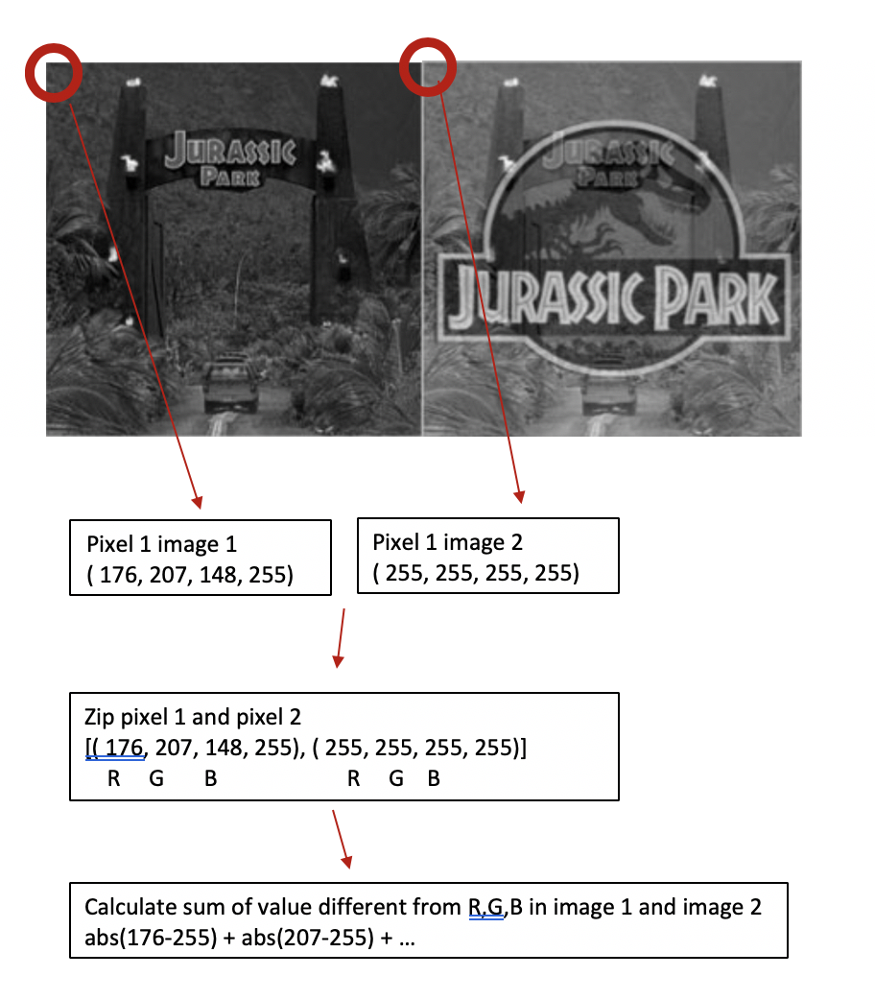
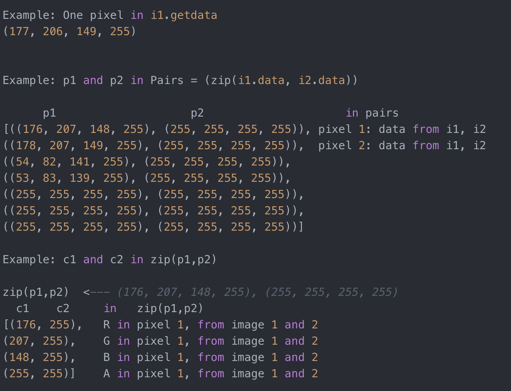

# Solution Approach - Pixel by Pixel Comparison

## Table of contents  

* [Background](#Background)
* [Thoughts Gathering](#Thoughts-Gathering)
* [Initial Approach](#Initial-Approach)
* [Improving](#Improving)
* [Advantages and Drawbacks](#Advantages-and-Drawbacks)


## Background
Image similarity is popular topics with various techniques to approach. In this project particularly, we would like to help an internal user automate his manual process of comparing images and estimating with a subjective similarity score.  

This automation could reduce repetitive work and lower the operational cost - or we can say to eliminate toil, from [Google SRE](https://landing.google.com/sre/sre-book/chapters/eliminating-toil/). 

With a clear request from the user, this project will read a cvs input file with pairs of images and output a result file with similarity score. Considering that it is an internal automation tool, therefore, the **accuracy, stability, performance and comprehensive documents** are important criteria.  

## Thoughts Gathering
From couple of lines of code to well-developed dedicated product, there are some common theories and methodologies for this image similarity comparison tools. Starting research on this topic, I found out a couple of techniques to accomplish this task. Here are some examples:  
- **Individual Pixel Comparison**: Compare RGB value of every individual Pixel.  
- **Structural Similarity Index (SSIM)**:  Perceptual metric that quantifies image quality degradation caused by processing.
- **Comparing Color Histograms**: Examine thegraphical representation of the color value distribution of a image.  
- **Feature matching**: Popular [OpenCV module (features2d)](https://docs.opencv.org/3.0-beta/modules/features2d/doc/features2d.html) to find the homography and overlapping.  
- **Keypoint Matching**: Focus on certain parts of an image contains more information than others.  
- And much more.   

As this is the first approach to complete this task, I would like to implement the simplest approach to make sure **I can deliver the program on time**.  The simplicity of internal tool also reduce the development and maintenance cost.

Another reason to consider is that as this is an internal tool built for colleague, **easy to understand, use and maintain** are important. Third party package or plugin might help with performace and accuracy but it takes more time to maintain as dependencies increase.  

Finally, the approach should be relatively stable and accurate.  

Based on these criteria, I have chose the Individual Pixel Comparison approach, with a detailed documentation which make further improvements possible and easy.  
  

## Initial Approach
The original workflow of this approach demonstrates as below:

1. Import the file contains image pairs into `image_list`.
2. For every pair element in `image_list` (image 1 and image 2), create image `i1` and `i2`.  
```python
i1 = Image.open(image_row[0])
i2 = Image.open(image_row[1])
```
3. For each pixel in `i1` and `i2`, subtract the RBG value accordingly and sum up the absolute difference from. For example, for the data pair (pixel 1 from `i1` and `i2`): ((176, 207, 148, 255), (255, 255, 255, 255)), we calculate the `dif` value from pixel 1 as below:  
```matlab
dif = abs(176 - 255) + abs(207 - 255) + abs(148 - 255)
```  
This example below demonstrate the pixel substraction.

###### Operations on each Piexel
 

For more details, take a look at the data demonstration shown below.  
  

Note: the last digital, 255 is The alpha channel which stays with 255 all the time for fully visible.  

4. We record the time `elapsed_time` after complete calculation, and convert `dif` into score of range [0, 1].  

5. Write the data, `dif` and `elapsed_time`into new cvs output file: `result.cvs`.  

## Improving  
Understanding the [drawbacks](#Advantages-and-Drawbacks)
of this pixels approach, this are some code refactoring and improvements I implemented after initial tryout.

1. Implement `resize` function to solve the case that two images with different sizes cannot be compared.
```python
def resize(i1, i2):
   if i1.size != i2.size:
       (width, height) = (i1.width, i1.height)
       i2 = i2.resize((width, height))
``` 

2. Create user-defined functions for reusable code blocks, which are more organized, easy to maintain and supportive of modular design approach.  

3. Add comments, error catch and debug script for future improvement, development and maintenance.  

4. Refactor the code to improve performance. Only call `resize`  if sizes are different. Only record the time for calculating dif as elapsed_time. 

## Advantages and Drawbacks
As mentioned earlier, individual pixel comparison approach is relatively fast and simple, easy to understand and maintain. However, I do realize there is a couple of drawbacks in this approach.  

1. Individual pixel comparison ignores the structural difference and color histograms. And it is easily affected by noise and grit.  

2. Images that are rotated, scaled or skewed can be identified as very different as this approach cannot match homography.  

I will be continouly working on this task and provide other alternative solutuion. [Update: please check the latest [SSIM approach](https://github.com/discoliver/image_comparison_opencv).]
