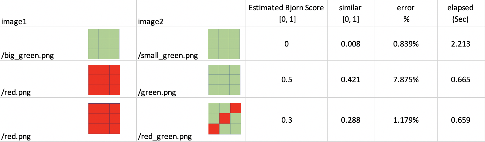
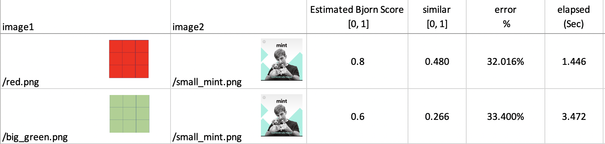
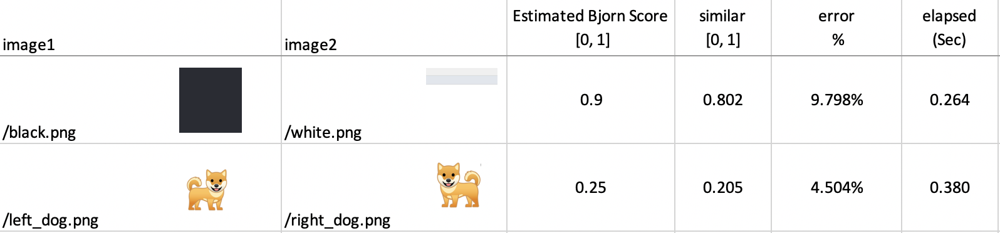
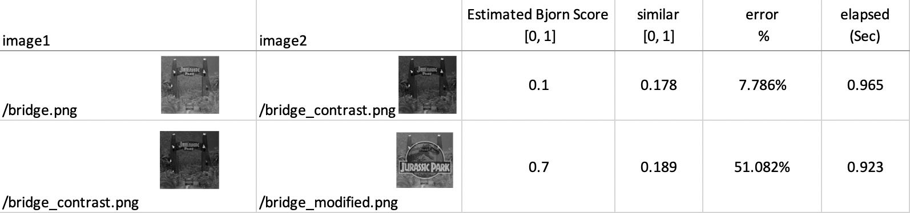
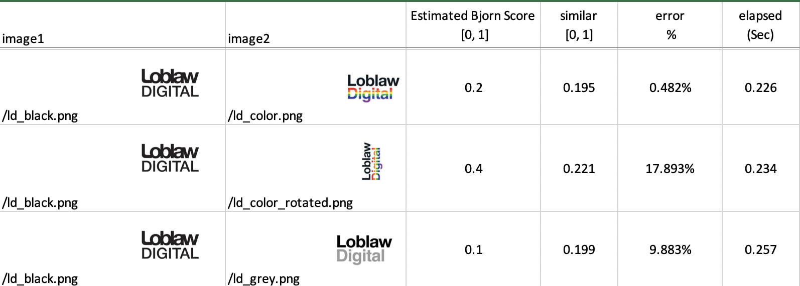

# Result and Test
After successfully run the program (See [FAQ](https://github.com/discoliver/image_comparison#faq) for error you might get), you should expect a **result.csv** file in the **Test** folder, which contains the information of 2 images, a similarity score and an elapsed time.

Re-run the program will automatically delete the file and regenerate the new result file.

However well this program performs? The **images.csv** contains a simple test set of images to demonstrate how this program handle each scenario.  

Be aware of the following restriction of the program (which will continue to improve) below:
>
- This program performs poorly with pictures with similar color histograms but significant structural difference.  
- ~~This program could only deal with RBG mode image, not the greyscale image.~~ This has been fixed by this [fix](https://github.com/discoliver/image_comparison/commit/830cdd09a56e861a5aa52604328442d17531594e)

I have included a short test analysis based on test set images. Compared with the actual similarity score and estimated Bjorn Score, the program could predict the similarity with a reasonable error while dealing with color histograms, but okay performance with structural differences. (Updated: this has been solved with [SSIM Approach](https://github.com/discoliver/image_comparison_opencv)).    

---
#### Test with pure color, with accurate result
  

#### Test with pure color and character, with  defective prediction as only focus on the color scheme.  

#### Test with pure color picture rotation.
  

#### Test with contrast adjustment and photoshoped picture
  

#### Test with contrast adjustment and photoshoped picture
  
