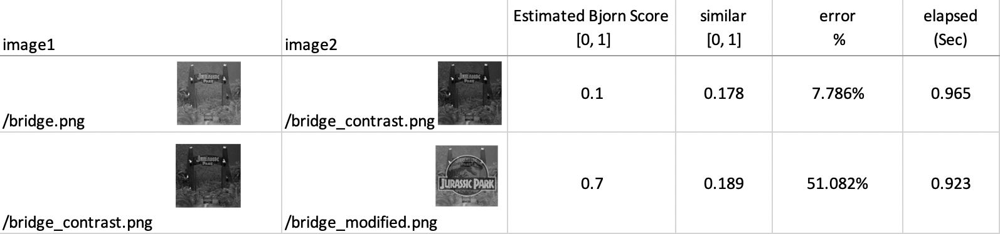
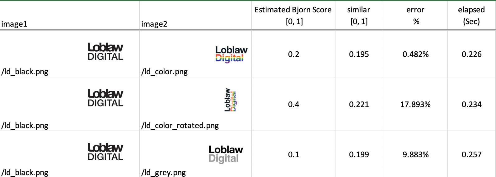

# Image Comparison

## Table of contents .

* [About the Program](#About-the-Program)
* [Getting Started](#Getting-Started)
* [How to Use the Program](##ow-to-Use-the-Program)
* [Solution Approach](#Solution-Approach)
* [Maintain the Program](#Maintain-the-Program)
* [Contribute and Update](#Contribute-and-Update)
* [Acknowledgments and License](#Acknowledgments-and-License)

## About the Program
A program written in Python that compares two images pixel by pixel. The input and output of the program will be in the format of cvs file.  

## Getting Started - Steps by Steps
### Environments
The program could be run in both Windows and MacOS system, either in Python IDE or Terminal (Commend Prompt in Windows)

If you are a Mac user, you can either download [PyCharm](https://www.jetbrains.com/pycharm/download/#section=mac) or running in your terminal directly, followed by the below instructions.  
If you are using Windows, you could do:
- Download [PyCharm](https://www.jetbrains.com/pycharm/download/#section=mac) - develop, test and run this program
- Download [Git](https://git-scm.com/download/win), and follow the Mac Instructions
- Running in Command Prompt directly, however you need to run the Windows version of the commands as this docs mainly cover the Linux/MacOS instruction.

### Install python  
To run this program, python 3 is required. If you do not have python installed, or wish to updated existing from python 2, you can do it from [download python](https://www.python.org/downloads/).

### Install Other Libraries  
The program requires Python Image Library - PIL. We can easily install  [Pillow](https://pillow.readthedocs.io/en/stable/installation.html), which is the friendly PIL fork by running following command:
```shell
$ pip3 install Pillow
```
This is the same command for Windows, MacOS and Linux  Installation

## How to Use the Program

### Clone This Repo
To clone this repo, you can use various source code management tool such as [Source Tree](https://www.sourcetreeapp.com/) and [Github Desktop](https://desktop.github.com/) or simply run
```shell
git clone https://github.com/discoliver/image_comparsion.git
```


### Running the Program
To run this program, simply run the **compare.py** script, following a cvs file path which contains pairs of images. Run the following command in your Terminal/Command Prompt or Pycharm Terminal.  
```shell
python3 compare.py filename.csv
```  
or
```shell
python3 compare.py absolute/path/to/your/filename.csv
```  
This repo has also provided an example of this input cvs file **images.csv**, which indicates the format should follow to use this program.  


### Result and Test
After successfully run the program (See [FAQ](#FAQ) for error you might get), you should expect a **result.csv** file in your local directory, which contains the information of 2 images, a similarity score and an elapsed time.

Re-run the program will automatically delete the file and regenerate the new result file.

However well this program perform? The **images.csv** contains a simple test set of images to demonstrate how this program handle each scenario.  

Be aware with the following restriction of the program (which will continue to improve) below:
>
- This program perform poorly with pictures with similar color histograms but significant structural difference.  
- This program could only deal with RBG mode image, not greyscale image.  

I have included a short test analysis based on test set images. Compared with the actual similarity score and estimated Bjorn Score, the program could predict the similarity with reasonable error while dealing with color histograms, but okay performance with structural difference. (Updated: this has been solved with [SSIM Approach](https://github.com/discoliver/image_comparison_opencv)).    

---
#### Test with pure color, with accurate result
  

#### Test with pure color and character, with poor prediction as only focus on color scheme.  


#### Test with pure color picture rotation.
  

#### Test with contrast adjustment and photoshoped picture
  

#### Test with contrast adjustment and photoshoped picture
  


## Solution Approach
### Backgroud
Image similarity is popular topics with various techniques to approach. In this particular case, we would like like to help an internal user automate his manual process and reduce the operational cost - or to eliminate toil, from [Google SRE](https://landing.google.com/sre/sre-book/chapters/eliminating-toil/). Therefore, the accuracy, stability , performance and comprehensive documents are important criterias.  

### Thoughts Gathering
From couple lines of code to well-developed dedicated application product, tools can be used for image similarity are based on some common theory or principle. Starting research on this topic, I found out couple of techniques to accomplish this task.  
- **Individual Pixel Compare**: Compare RGB value of every individual Pixel.  
- **Structural Similarity Index (SSIM)**:  Compare group of pixels.  
- **Comparing histograms**: Examine the distribution of values in each sample.  
- **Feature matching**: Popular [OpenCV module (features2d)](https://docs.opencv.org/3.0-beta/modules/features2d/doc/features2d.html) to find the homography and overlapping.  
- **Keypoint Matching**: Focus on the certain parts of an image contains more information than others.  
- And much more.   

This project starts with the simplest and most straight forward solution, Individual Pixel Compare, based on the several criteria below.  
1. Accuracy
2. Simplicity with low development cost
3. Easy to understand and maintain
4. Stability without frequent update

However, if more time allowed and more information provided, other solutions could be implement and tailored to this definitely.  


### Initial Approach
The original workflow of this approach demonstrate as below:

1. Import the Image files into `image_list` from cvs.  
2. For every row of data in cvs (every element in `image_list`), create image `i1` and `i2`.  
```python
i1 = Image.open(image_row[0])
i2 = Image.open(image_row[1])
```
3. For each pixel from `i1` and `i2`, subtract the RBG value accordingly and sum up the absolute difference from R, G, B.  
For example, for the data pair (pixel 1 from `i1` and `i2`): ((176, 207, 148, 255), (255, 255, 255, 255)), we calculate the `dif` value from pixel 1 as below:  
```matlab
dif = abs(176 - 255) + abs(207 - 255) + abs(148 - 255)
```  

 The last digital, 255 is The alpha channel which stays with 255 all the time for fully visible.  

4. We record the time `elapsed_time` after complete calculation, and convert `dif` into score of range [0, 1].  

5. Import the data, `dif` and `elapsed_time`into new cvs output file, `result.cvs`.  

### Improving  
Understanding the [drawbacks](#Advantages-and-Drawbacks)
 of this pixels approach, there are still couple of code refactoring and improvement on the program could be made.  

1. Implement resize function to solve the case that two images have different size and not able to be compared.
```python
def resize(i1, i2):
    if i1.size != i2.size:
        (width, height) = (i1.width, i1.height)
        i2 = i2.resize((width, height))
```  

2. Create user-defined functions for reusable code blocks, which are more organized, easy to maintain and support modular design approach.  

3. Add comments, error catch and debug script for future improvement, development and maintenance.  


### Advantages and Drawbacks
As mentioned earlier, individual pixel comparison approach is relative fast and simple, easy to understand and maintain. However, I do reaize there are couple of drawback in this approach.  

1.  Individual pixel comparison ignore the structural histograms and are easily affect by noise and grit.  

2. Images that are rotated, scaled or skewed can be indentified as very different as this appraoch cannot match homography.  

## Maintain the Program
To Maintain this application, please go through this README carefully and [contact me](mailto:b96wang@edu.uwaterloo.ca?subject=[GitHub]%20Source%20Han%20Sans) if you have any question. Additional knowledge transfer session will be hold.

Ensuring that you have understood the logic of the program is fundamental to maintain this project, however, there are couple tips can help as well.  

1. Read error log - details catch error and debug output is written in the script.
2. Check your environment - although this program does not require many dependencies, you still have to check you have correct version of python, and other libraries installed.  
3. Always test it when you contribute this program; Work in specific topic branches and keep the commit history clean, with proper tag if necessary.  
4. Refer to [FAQ](#FAQ) session for common question.

## Contribute and Update
Your contribution are warmly welcomed to make this project better. Please fork the repository and create pull request if you want. Appreciate anyone to jump in and help out.

Please refer to `CONTRIBUTING.md` (coming) for more details.  

This project does not include much dependency but a few things below could help you maintain the latest version of the application.
- Github Notification when updates or new pull request has been merged (coming)
- Ensure you have the latest version of pillow
- Ensure your Python is up-to-date

## Acknowledgments and License
There are a few helpful examples and research help to shape this project, and they have demonstrated the different perspectives and methods to accomplish the test. Here are some of good references.  

[Image Module](https://pillow.readthedocs.io/en/stable/reference/Image.html), The Image module provides a class with the same name which is used to represent a PIL image.  
[Rosetta Code](https://rosettacode.org/wiki/Percentage_difference_between_images#Python), Percentage difference between images .  
[Adrian Rosebrock](https://www.pyimagesearch.com/2014/09/15/python-compare-two-images/), How-To: Python Compare Two Images .

This project is licensed under the MIT License.

## FAQ
Frequently asked questions about this program can be found below.  

### How to ensure this program works?
There are some test files in the image folders, which covers different case from modification, contrast adjustment and image rotation. Feel free to contribute more test case or contact the author if you needed.  


### Is there any additional Training resource about this program?  
Yes. You have found detailed material in [image similarity](https://rosettacode.org/wiki/Percentage_difference_between_images) and [python image library](https://pillow.readthedocs.io/en/stable/).
Additionally, a knowledge transfer session and detailed walk through will be provided when delivering this program. You can also contact the author for quick help.

### What if I have received error?  
Check the console output to quickly categorize the error either in:  
- Your system environment, either python or related libraries is setup incorrectly.  
- Your input csv contains wrong format.  
- Your image mode is not RGB or the format we do not support.  

### Can I input cvs files with different format?  
Unfortunately, you have to follow the format of the provided csv example.

### Does this program restrict to MacOS?  
This program can be running on MacOS, Windows and Linux, as long as you have configured correctly. (See getting started)
The easiest way to run on Windows is to get Git Bash and follow the MacOS instruction, but you can always run in Windows Command Prompt or Pycharm IDE.  
